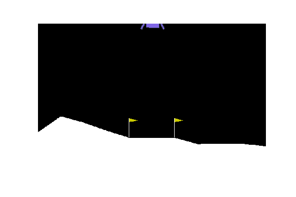

# Reinforcement Learning

Exploring Open AI and Ray Python libraries in order to create a [Deep Q Network](https://rllib.readthedocs.io/en/latest/rllib-algorithms.html#dqn) to solve the Open AI [Lunar Lander](https://gym.openai.com/envs/LunarLander-v2/) problem.

### Agent Performing Random Sampled Actions

### Trained Agent

